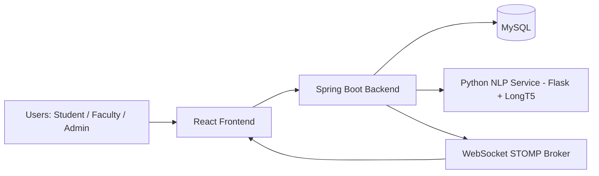
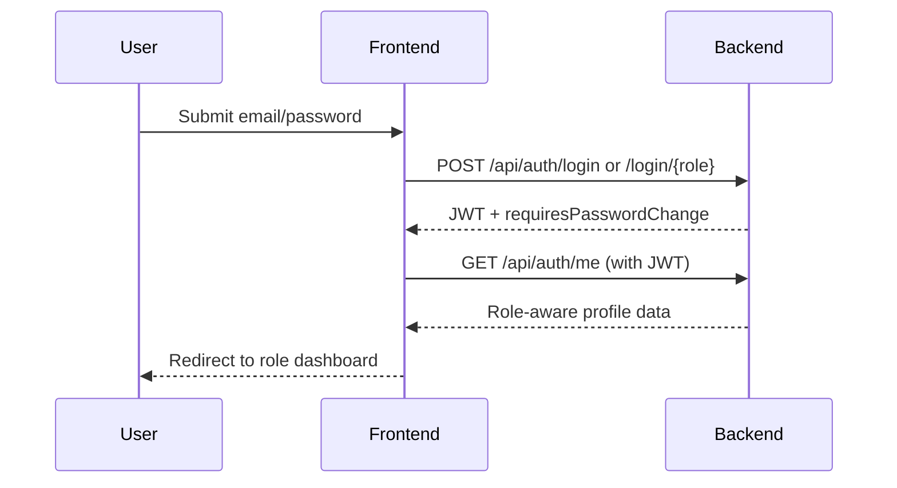
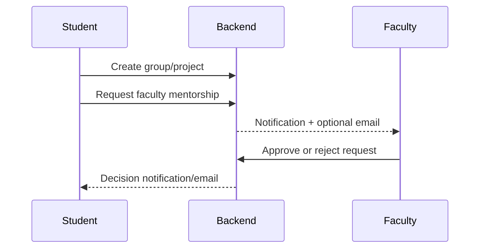
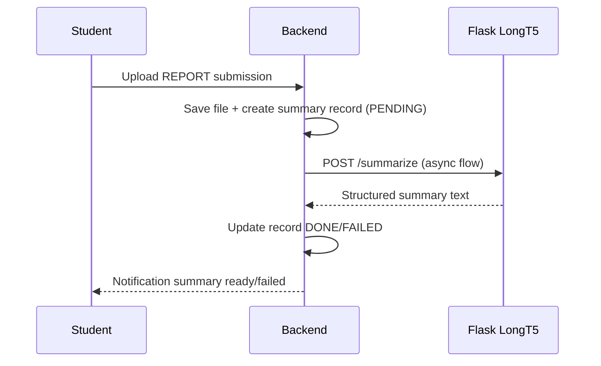
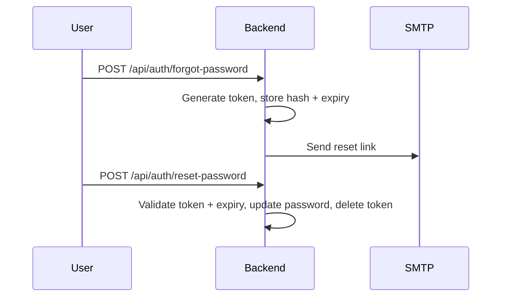

# MentorLink

<p align="center">
  
</p>

<p align="center">
  
  
  
  
  
  
  
</p>

MentorLink is a full-stack academic mentorship platform for managing student projects, group formation, mentor matching, submissions, progress tracking, and report intelligence in one place.

It combines:
- secure role-based workflows (Student / Faculty / Admin),
- recommendation-assisted mentor selection,
- asynchronous LLM summarization for project reports,
- and real-time notification delivery.

---

## Table of Contents

- [1. Why MentorLink](#1-why-mentorlink)
- [2. Core Capabilities](#2-core-capabilities)
  - [2.3 Frontend (dashboard UI)](#23-frontend-dashboard-ui)
- [3. Architecture](#3-architecture)
- [4. Repository Structure](#4-repository-structure)
- [5. Tech Stack](#5-tech-stack)
- [6. Quick Start](#6-quick-start)
- [7. Configuration and Environment Variables](#7-configuration-and-environment-variables)
- [8. API Map](#8-api-map)
- [9. Workflow Deep Dive](#9-workflow-deep-dive)
- [10. Recommender Engine Details](#10-recommender-engine-details)
- [11. NLP Summarization Pipeline](#11-nlp-summarization-pipeline)
- [12. Security Model](#12-security-model)
- [13. Data Model Snapshot](#13-data-model-snapshot)
- [14. Testing](#14-testing)
- [15. Troubleshooting](#15-troubleshooting)
- [16. Performance and Operational Notes](#16-performance-and-operational-notes)
- [17. Roadmap](#17-roadmap)
- [18. Contribution Guide](#18-contribution-guide)
- [19. License](#19-license)

---

## 1. Why MentorLink

In many institutions, project mentorship is still managed manually through spreadsheets, messages, and ad-hoc updates. That leads to:
- unclear accountability,
- delayed faculty assignment,
- poor progress visibility,
- and high administrative overhead.

MentorLink addresses these issues through a structured, role-aware system that supports:
- controlled project and group workflows,
- transparent mentor assignment and load balancing,
- structured submissions and meeting history,
- and AI-driven assistance for recommendation and summarization.

---

## 2. Core Capabilities

### 2.1 Role-Based Features

| Role | Major Features |
|---|---|
| Student | Register/login, **one project group** (create *or* join once—UI and API block a second group), assigned project workflow, mentor requests, submissions, meetings, notifications |
| Faculty | Dashboard, assigned projects, students list, recommendations, mentorship approve/reject, meeting verification |
| Admin | Bulk Excel upload (students/faculty), deadlines, auto-group, analytics, users, yearly reset |

### 2.2 Platform Highlights

- JWT authentication with role-based authorization.
- **Student rule:** each student belongs to **at most one** group; create/join/create-project flows enforce this in the API and the student UI hides extra create/join entry points once a group exists.
- Group join and mentor join token workflows.
- Faculty recommendation (TF-IDF + cosine similarity APIs; matrix-factorization pipeline for admin batch jobs where configured).
- Auto-grouping after deadline using cosine similarity over student profile signals.
- Asynchronous PDF summarization via LongT5.
- Real-time notifications with STOMP over WebSocket/SockJS.
- **Email:** HTML templates (Thymeleaf), MIME mail, `@Async` sending for welcome, password reset, deadline reminders, and faculty decision mail—**SMTP credentials must be supplied via environment variables** (see [§7](#7-configuration-and-environment-variables)).
- Forgot/reset password with expiring one-time token.

### 2.3 Frontend (dashboard UI)

- **React 19**, **Vite 7**, **Tailwind CSS v4**, **React Router v7**.
- **SaaS-style shell:** collapsible sidebar, top bar (search, notifications, profile), animated page transitions (**Framer Motion**), shared **design tokens** (`--mentor-primary`, etc.).
- Reusable **UI kit** under `frontend/src/components/ui/` (buttons, cards, tables, modals, alerts, …) plus **layout** components under `frontend/src/components/layout/`.
- **Role-based navigation** in the sidebar (student / faculty / admin) with **lucide-react** icons.

---

## 3. Architecture



### Service Communication

- Frontend -> Backend: REST over HTTP.
- Backend -> NLP: multipart HTTP call to `/summarize`.
- Backend -> Frontend: WebSocket notifications on `/topic/notifications/{userId}`.

### Runtime Ports

| Service | Default Port |
|---|---|
| Frontend (Vite) | `3000` |
| Backend (Spring Boot) | `8080` |
| NLP Summarization (Flask) | `5001` |

---

## 4. Repository Structure

```text
mentorlink/
|- backend/
|  |- pom.xml                     # Maven project (run Maven from backend/ or use -f backend/pom.xml)
|  |- src/main/java/com/mentorlink/
|  |  |- config/                  # Security, CORS, WebSocket, RestTemplate
|  |  |- modules/
|  |  |  |- auth/                 # Register/login/change-password/forgot-reset
|  |  |  |- admin/                # Analytics, deadlines, bulk upload, auto-group
|  |  |  |- groups/               # Group create/join/mentor token flow
|  |  |  |- projects/             # Project lifecycle + progress
|  |  |  |- faculty/              # Mentorship request approval flow
|  |  |  |- recommender/          # Mentor recommendation APIs + jobs
|  |  |  |- submissions/         # Upload/list/delete/download files
|  |  |  |- summarization/        # Async NLP integration + summary records
|  |  |  |- meetings/             # Meeting log + schedule negotiation
|  |  |  |- notifications/        # REST + real-time notifications
|  |  |  |- dashboard/            # Student/faculty/admin dashboard payloads
|  |  |- service/                 # Email (Thymeleaf + JavaMail), schedulers, recommender glue
|  |  |- util/                    # File storage, excel parser, similarity helpers
|  |- nlp-summarization/          # Python summarization microservice
|  |- src/main/resources/
|  |  |- application.properties   # Defaults; secrets via env (especially mail)
|  |  |- templates/email/        # Thymeleaf HTML bodies (welcome, reset, deadlines, approvals)
|- frontend/
|  |- src/pages/                  # Role-aware screens (dashboards, projects, admin, …)
|  |- src/components/
|  |  |- layout/                  # Sidebar, Topbar, DashboardLayout
|  |  |- ui/                      # Design-system primitives (Button, Card, Table, …)
|  |  |- common/                  # Empty states, shared pieces
|  |- src/context/                # Auth, notifications, toasts
|  |- src/hooks/                  # WebSocket + notification hooks
|  |- src/lib/api.js              # Axios client and endpoint wrappers
|- uploads/                       # Stored files (runtime)
|- package.json                   # Root orchestrator (concurrently: backend + frontend + NLP)
```

---

## 5. Tech Stack

| Layer | Technology |
|---|---|
| Frontend | React 19, Vite 7, **Tailwind CSS v4**, React Router v7, Axios, Recharts, **lucide-react**, **Framer Motion** |
| Backend | Spring Boot 3.5.5, Java 17, Spring Security, Spring Data JPA, **Thymeleaf** (email HTML), JavaMail (MIME) |
| Database | MySQL (runtime), H2 (tests) |
| Auth | JWT (jjwt), BCrypt |
| Realtime | STOMP + SockJS |
| Files | Multipart upload + filesystem storage |
| NLP | Python Flask, PyMuPDF, HuggingFace Transformers (LongT5), Torch |
| Build Tools | **Maven** (`backend/pom.xml`), npm |
| Automation | Scheduled jobs + `@Async` (e.g. outbound mail) |

---

## 6. Quick Start

### 6.1 Prerequisites

- Node.js 18+ and npm
- Java 17+
- Maven 3.9+
- Python 3.9+
- MySQL 8+

### 6.2 Install Dependencies

From project root:

```bash
npm run setup
```

This installs:
- root and frontend npm packages,
- Python dependencies in `backend/nlp-summarization/requirements.txt`.

### 6.3 Start Full System

```bash
npm run start
```

This runs concurrently:
- `npm run start:backend`
- `npm run start:frontend`
- `npm run start:nlp`

### 6.4 Start Services Individually

```bash
npm run start:backend
npm run start:frontend
npm run start:nlp
```

### 6.5 Open the App

- Frontend: [http://localhost:3000](http://localhost:3000)
- Backend API base: [http://localhost:8080](http://localhost:8080)
- NLP health: [http://localhost:5001/health](http://localhost:5001/health)

### 6.6 Backend Maven commands

The Java **POM** lives in **`backend/`**, not the repository root. From the repo root use either:

```bash
cd backend
mvn clean test
```

or:

```bash
mvn -f backend/pom.xml clean test
```

Running `mvn` in `mentorlink/` without `-f` will fail with “no POM in this directory”.

---

## 7. Configuration and Environment Variables

### 7.1 Backend Configuration (`backend/src/main/resources/application.properties`)

Key properties include:
- datasource URL/username/password,
- JWT secret and expiry,
- **Mail:** `spring.mail.*` is wired from **`MAIL_*` environment variables**—sender username/password are **not** hardcoded in the repo; without them, registration still succeeds but **welcome and other mails are skipped** (see logs).
- upload directory and size limits,
- NLP service URL,
- Thymeleaf settings for `classpath:/templates/email/*.html`.

### 7.2 Recommended Environment Variables

| Variable | Purpose | Example |
|---|---|---|
| `JWT_SECRET` | JWT signing key (use strong 32+ char secret) | `your-very-long-secret` |
| `MAIL_USERNAME` | Sender email for SMTP | `you@example.com` |
| `MAIL_PASSWORD` | SMTP password/app password | `xxxx xxxx xxxx xxxx` |
| `MAIL_HOST` | SMTP host | `smtp.gmail.com` |
| `MAIL_PORT` | SMTP port | `587` |
| `APP_FRONTEND_URL` | Base URL for password reset links | `http://localhost:3000` |
| `NLP_SUMMARIZATION_URL` | NLP Flask service URL | `http://localhost:5001` |
| `UPLOAD_DIR` | Uploaded file storage location | `../uploads` |

### 7.3 Security Note

- Do not commit real secrets to source control.
- Move credentials to environment variables for production deployment.

### 7.4 Transactional email (implementation summary)

| Piece | Description |
|---|---|
| Templates | `backend/src/main/resources/templates/email/` — Thymeleaf HTML for password reset, welcome, deadline reminder, faculty approval/rejection. |
| Rendering | `EmailTemplateService` builds HTML via `ITemplateEngine`. |
| Delivery | `EmailNotificationService` uses `MimeMessage` + `MimeMessageHelper` (UTF-8, HTML body) and `@Async` methods so HTTP handlers are not blocked. |
| Config | Set `MAIL_HOST`, `MAIL_PORT`, `MAIL_USERNAME`, `MAIL_PASSWORD` before starting the backend (same shell as `npm run start`, or system env). Gmail typically requires an [App Password](https://myaccount.google.com/apppasswords). |

---

## 8. API Map

### 8.1 Authentication

- `POST /api/auth/register/student`
- `POST /api/auth/register/faculty`
- `POST /api/auth/register/admin`
- `POST /api/auth/login`
- `POST /api/auth/login/student`
- `POST /api/auth/login/faculty`
- `POST /api/auth/login/admin`
- `POST /api/auth/change-password`
- `POST /api/auth/forgot-password`
- `POST /api/auth/reset-password`
- `GET /api/auth/me`
- `PUT /api/auth/update`

### 8.2 Student / Group / Project

- `POST /api/groups/create`
- `POST /api/groups/join/{token}`
- `POST /api/groups/mentor/join/{token}`
- `POST /api/groups/{groupId}/request-faculty`
- `GET /api/groups/{groupId}`
- `POST /api/projects/create`
- `GET /api/projects/{projectId}`
- `PUT /api/projects/{projectId}/title`
- `PUT /api/projects/{projectId}/progress`

### 8.3 Meetings

- `POST /api/projects/{projectId}/meetings`
- `GET /api/projects/{projectId}/meetings`
- `POST /api/projects/{projectId}/meetings/{meetingId}/verify`
- `POST /api/projects/{projectId}/meeting-schedule`
- `POST /api/projects/{projectId}/meeting-schedule/{scheduleId}/approve`
- `POST /api/projects/{projectId}/meeting-schedule/{scheduleId}/counter`
- `POST /api/projects/{projectId}/meeting-schedule/{scheduleId}/accept`
- `POST /api/projects/{projectId}/meeting-schedule/{scheduleId}/propose-new`
- `GET /api/projects/{projectId}/meeting-schedule`

### 8.4 Submissions and Summaries

- `POST /api/submissions/project/{projectId}`
- `GET /api/submissions/project/{projectId}`
- `GET /api/submissions/group/{groupId}`
- `DELETE /api/submissions/{submissionId}`
- `GET /api/submissions/{submissionId}/download`
- `POST /api/projects/{projectId}/summarize-report`
- `GET /api/projects/{projectId}/summaries`

### 8.5 Recommender

- `POST /api/recommend/mentor`
- `POST /api/recommend/mentor/top/{topN}`
- `GET /api/recommend/mentor/project/{projectId}`

### 8.6 Admin

- `POST /api/admin/upload/students`
- `POST /api/admin/upload/faculty`
- `POST /api/admin/deadlines`
- `GET /api/admin/deadlines`
- `PUT /api/admin/deadlines/{id}/extend`
- `GET /api/admin/students/without-group`
- `GET /api/admin/students/without-group/export`
- `GET /api/admin/faculty/export`
- `POST /api/admin/auto-group/from-leftover`
- `POST /api/admin/auto-group/from-excel`
- `POST /api/admin/projects/{projectId}/assign/{facultyId}`
- `POST /api/admin/projects/{projectId}/unassign`
- `GET /api/admin/analytics`
- `GET /api/admin/groups`
- `GET /api/admin/groups/{groupId}`
- `PUT /api/admin/faculty/{facultyId}/max-groups`

---

## 9. Workflow Deep Dive

### 9.1 Login and Role Routing



### 9.2 Group to Mentor Pipeline



### 9.2a One group per student

- A student may belong to **only one** group at a time.
- **API:** `GroupService.createGroup`, `GroupService.joinGroup`, and `ProjectService.createProject` reject attempts to create or join a second group while the user is already a member of another group.
- **UI:** After a group exists, student pages such as **Groups**, **Create group**, **Join group**, and **Projects** no longer surface redundant “create / join another group” actions (direct URL access to create/join redirects back to the student Groups hub when appropriate).

### 9.3 Submission to NLP Summary



### 9.4 Password Reset Flow



---

## 10. Recommender Engine Details

Mentor recommendation uses textual similarity between project context and faculty expertise.

### 10.1 Current Algorithm

- Text preprocessing: lowercase, tokenize, stopword removal.
- Vectorization: TF-IDF over corpus `[project + all faculty texts]`.
- Scoring: cosine similarity.
- Re-ranking: higher score first; availability considered for tie-breaking.

### 10.2 Formula Snapshot

- `TF(t,d) = count(t in d) / |d|`
- `IDF(t) = log(1 + N / df(t))`
- `TF-IDF(t,d) = TF * IDF`
- `cos(A,B) = (A.B) / (||A|| ||B||)`

### 10.3 Auto-Grouping Logic

Admin auto-grouping uses cosine similarity over student profile tags:
- normalized skills,
- department tags,
- year-of-study tags.

Constraints:
- groups formed in sizes 2 to 3,
- only leftover students are considered,
- execution is gated by `GROUP_FORMATION` deadline,
- faculty assignment respects load (`currentLoad < maxGroups`).

---

## 11. NLP Summarization Pipeline

The Python microservice executes:
1. PDF extraction (PyMuPDF)
2. Irrelevant section filtering
3. Text cleaning
4. Chunking (~1200 words)
5. LongT5 summarization per chunk
6. Final aggregation pass
7. Post-processing (dedupe, structure normalization)

Expected output sections:
- Objective
- Methodology
- Technologies Used
- Key Results
- Conclusion

Operational notes:
- first model load downloads substantial weights,
- async backend orchestration prevents API blocking,
- summary records expose `PENDING`, `PROCESSING`, `DONE`, `FAILED`.

---

## 12. Security Model

- JWT-based stateless authentication.
- Role-based access controls in Spring Security filter chain.
- Password hashing with BCrypt.
- Centralized exception mapping for consistent API error payloads.
- Protected profile, project, group, submission, recommender, and admin routes.
- Password reset token hashing (SHA-256) + expiry + one-time use.

---

## 13. Data Model Snapshot

Major tables/entities:

| Domain | Tables / Entities |
|---|---|
| Identity | `users`, `user_roles`, `student_profiles`, `faculty_profiles` |
| Collaboration | `project_groups`, `group_members`, `projects`, `faculty_mentorship_requests` |
| Delivery & Review | `submissions`, `report_summaries`, `meetings`, `meeting_schedule_requests` |
| Governance | `deadlines`, `notifications`, `password_reset_tokens` |
| Auxiliary | `chat_messages`, skill/interest/achievement collections |

---

## 14. Testing

### 14.1 Backend Tests Present

- Spring context load tests.
- Auth integration flow (`register -> login`) with test profile.

Run backend tests:

```bash
cd backend
mvn test
```

### 14.2 Frontend Tests

No automated frontend test suite is currently committed. Add unit/integration tests as the next quality milestone.

---

## 15. Troubleshooting

<details>
<summary><strong>Backend fails with MySQL connection refused</strong></summary>

Ensure MySQL is running and matches:
- `spring.datasource.url`
- `spring.datasource.username`
- `spring.datasource.password`

</details>

<details>
<summary><strong>Frontend cannot call API (proxy errors)</strong></summary>

Check:
- backend running on `http://localhost:8080`,
- frontend running on `http://localhost:3000`,
- Vite proxy config in `frontend/vite.config.js`.

</details>

<details>
<summary><strong>Emails not sent (e.g. after registration)</strong></summary>

1. Set **`MAIL_USERNAME`** and **`MAIL_PASSWORD`** in the environment **before** starting the backend (child process of `npm run start` inherits the parent shell’s env on Windows/macOS/Linux).
2. Restart the stack so Spring picks up the variables.
3. Check backend logs: you should see **`Email configured for outbound mail from: …`** on startup; if you see **`spring.mail.username is empty`**, mail is disabled and welcome mail is **skipped by design**.
4. Check the recipient’s **Spam** folder.
5. For HTML/template errors, look for **`Failed to send welcome email`** stack traces in logs.

</details>

<details>
<summary><strong>NLP summaries stuck in PROCESSING/FAILED</strong></summary>

Verify:
- NLP service is running on port `5001`,
- `NLP_SUMMARIZATION_URL` is correct,
- Python dependencies installed,
- machine has enough RAM for model load.

</details>

<details>
<summary><strong>Forgot password email not arriving</strong></summary>

The API returns a generic success message for security. Check backend logs and SMTP config. Token generation is guarded by mail config in current implementation.

</details>

---

## 16. Performance and Operational Notes

- API operations are mostly transactional and lightweight.
- Long-running summarization is offloaded asynchronously.
- Scheduler sends reminder emails daily (default cron at 9 AM).
- Upload limit is configured to 50MB.
- Notification pushes are real-time via WebSocket topics.
- **Dev logging:** with `spring.jpa.show-sql=true`, Hibernate prints SQL to the console; that is useful for debugging but noisy. It does not materially slow typical requests; set `spring.jpa.show-sql=false` for quieter logs.

---

## 17. Roadmap

- Add frontend automated testing (unit + e2e).
- Add observability dashboard (metrics/traces).
- Add fairness-aware recommendation and explainability overlays.
- Add containerized deployment profiles.
- Expand chat module from entity-only persistence to full real-time flow.
- Add optional classifier module for AI vs human text detection.

---

## 18. Contribution Guide

1. Fork the repository.
2. Create a feature branch.
3. Keep changes scoped and documented.
4. Add/adjust tests where possible.
5. Submit a pull request with:
   - problem statement,
   - implementation summary,
   - testing notes,
   - screenshots for UI changes.

---

## 19. License

This project is distributed under the MIT License unless replaced by your institution/repository policy.

---

<p align="center">
  Built for smarter academic mentorship workflows.
</p>
